## Question 4

**Single sign-on in Camunda**

### Estimated reading time: 6 minutes, 56 seconds

### The problem:

You've deployed Camunda and have been successfully running processes there for a while. It's becoming more and more popular, and managing the users via the web Admin app is becoming more and more cumbersome and time consuming. Single-sign-on (SSO) or an external authentication and authorization server seems like a great solution, so how do you make that work?

### The high-level answer:

This is a very popular topic, and one that has about as many answers as you can dream up. Much of this depends on what you plan to use to facilitate your Single Sign On (SSO) capabilities. We can go through a couple of examples here.

First thing is to understand the Authentication method provided by Camunda. You can read about the [Basic Authentication](https://docs.camunda.org/manual/latest/reference/rest/overview/authentication/) method, which is what most of the solutions are based on.

You can therefore provide your own implementation, add it to the web.xml (as described in the basic auth example) and all requests should be authenticated using your implementation.

This only solves the authentication part of the issue, and Authorization details still need to be provided in Camunda itself (usernames and groups need to exist, etc.) but it is a jumping-off point.

Now, if you're looking for a more fully-complete solution, the Camunda Consulting Team has provided a complete solution using the Camunda Springboot Starter, with Springboot Security. You can find that entire project on the [Camunda Consulting](https://github.com/camunda-consulting/code/tree/master/snippets/springboot-security-sso) Github site.

Likewise there is a Camunda [JBoss SSO](https://github.com/camunda/camunda-sso-snippets) example, and a [Keycloak example](https://github.com/camunda/camunda-sso-snippets) as well.

With all these examples, combined with the [documentation](https://docs.camunda.org/manual/latest/reference/rest/overview/authentication/) you should be well on your way to implementing a custom SSO solution.

### The detailed implementation answer

Since practical, hands-on information is the most useful, let's take a look at how to implement a [Keycloak](https://keycloak.org) user authentication server in front of Camunda. Keycloak is also Open Source, so it's a perfect compliment to Camunda as an authentication server, and you can use it for SSO for a large number of applications, so it's a good choice.

To get started, you'll want to download a copy of Keycloak. You can use either the regular distribution or the Docker version as either one will work for these purposes. This post will be using the Keycloak v15.0.2 Wildfly distribution.

I did nothing other than download the distribution and run `standalone.sh` in the `keycloak-15.0.2/bin` directory.

> **Note:** Though I'll be showing examples using unsecured `http` you should really never do authentication over anything but TLS (`https`). YOu'll be passing usernames and passwords back and forth, and doing that unencrypted is a terrible idea.

Keycloak starts up by default listening to `http://127.0.0.1:8080/auth`, so if you point your browser there, you will initially be asked to create the first suer, who will be your Admin User.

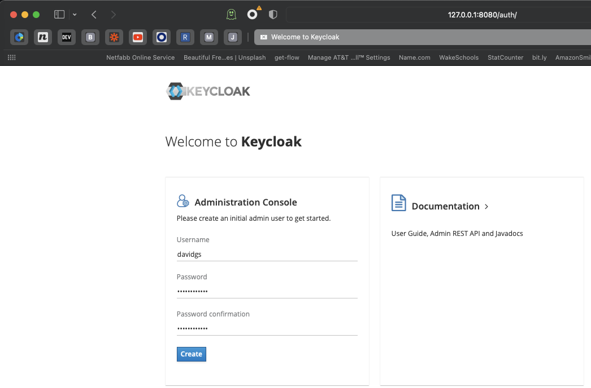

You can then use that new user to login to the Keycloak Administration page. The first thing you will need to do is create a new Realm. You could use the `master` realm, but this is generally considered bad practice.

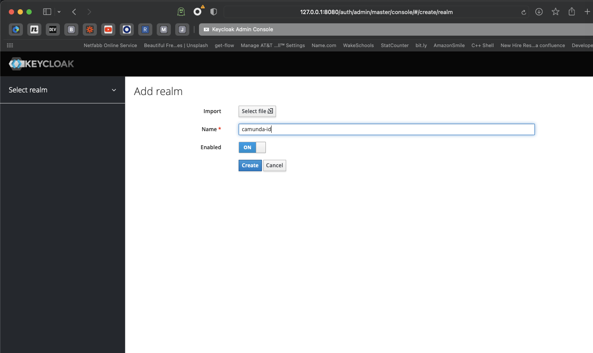

We are going to call our realm `camunda-id`.

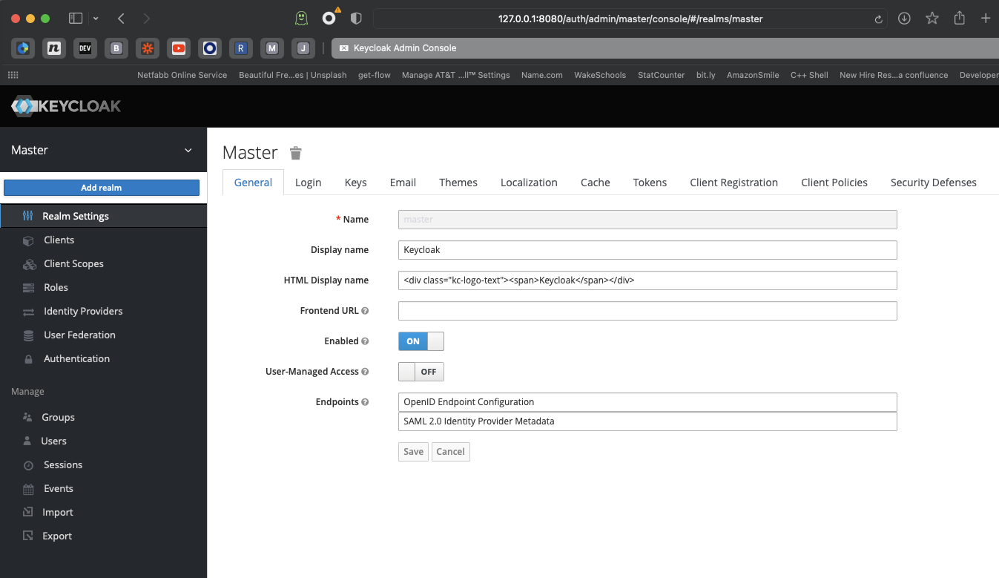

Now that you have a new realm, you'll need to create a new client in that realm for the actual authentication to happen. There are a few settings that you *have* to get right or keycloak will not function correctly. The first is that this server will be using the `confidential` access type.

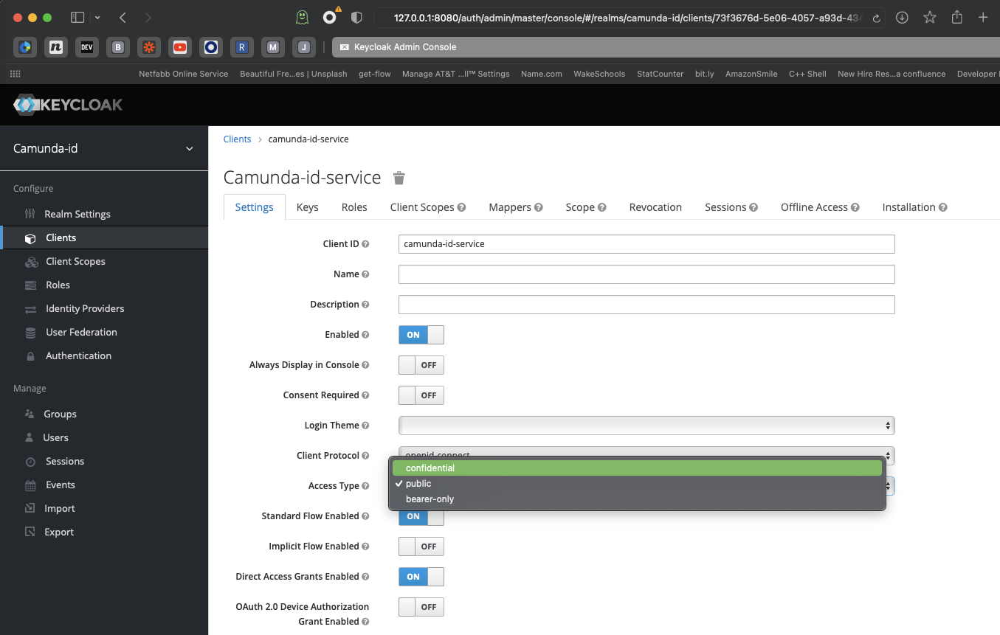


The second one is the Redirect URI. This is where our first dilemma arises. Keycloak is running on port 8080, but that's also the default port for Camunda Platform Run. One of them will have to move. Since we've already started Keycloak on port 8080, we will move Camunda Platform Run to port 8181.


Getting the redirect URI correct is one of the most common problems in getting Keycloak to work as an authentication server.

Next, you want to make sure and enable `service accounts` as we will be using these.

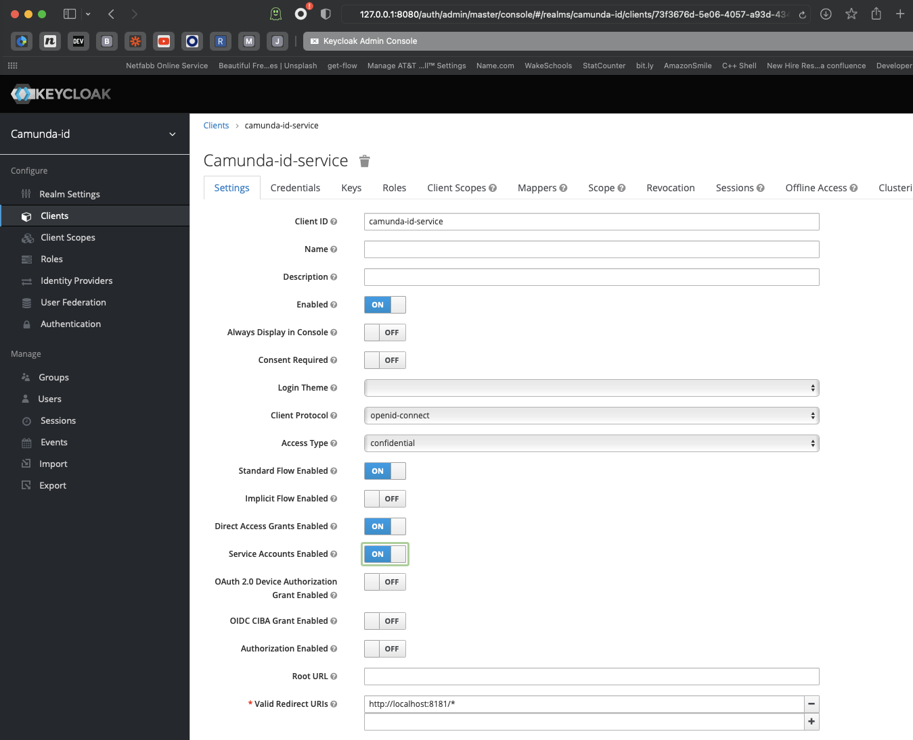

The final setting to pay attention (since it's not a default setting) is turning on the "Use Refresh Tokens for Client Credentials Grant". This setting is under the "OpenID Connect Compatibility Mode" submenu. Don't forget to save your configuration!

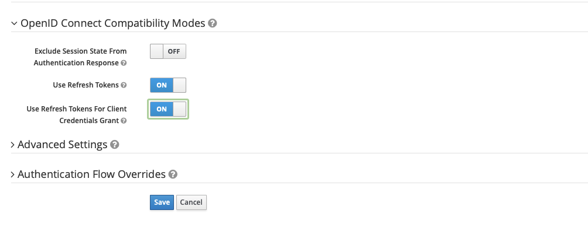

Next we're going to create an admin group for our Camunda realm.

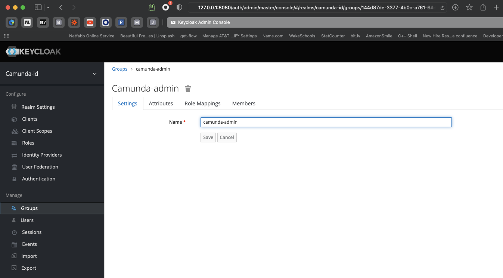

This next part is the only tricky bit. You have to assign some roles to the realm client, so click on Clients in the sidebar, and you should see a tab called Service Account Roles which is where we will be assigning roles.

Under Client Roles you will select `realm-management` and choose the following Available Roles: `query-groups`, `query-users`, and `view-users`.

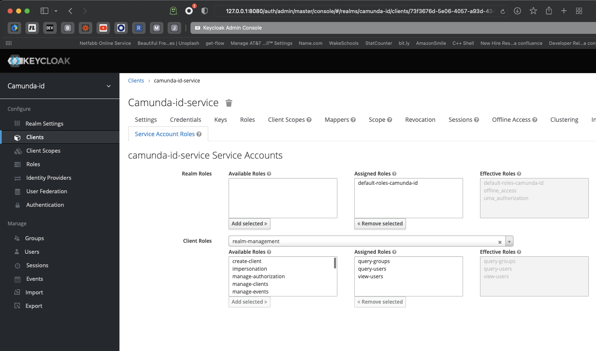

We're almost there, I promise!

Finally, you will want to create a user or two that will be able to login to Camunda Platform. This setup will not enable the 'registration' option, so the users should already exist.

### Time to get Camunda Platform running

Now that we have a functioning (we hope) instance of Keycloak, it's time to get Camunda Platform Run going so we can use the Keycloak service to authenticate.

I will be using [Camunda Platform Run v7.16.0](https://camunda.com/download/) for this exercise.

We will start by editing the `default.yml` file in the `configuration` directory.

You will need to add the following lines:

```
# Camunda Keycloak Identity Provider Plugin
plugin.identity.keycloak:
  keycloakIssuerUrl: http://localhost:8080/auth/realms/camunda-id
  keycloakAdminUrl: http://localhost:8080/auth/admin/realms/camunda-id
  clientId: camunda-id-service
  clientSecret: <copy from your client secret on Keycloak Server>
  useUsernameAsCamundaUserId: true
  useGroupPathAsCamundaGroupId: true
  administratorGroupName: camunda-admin
  disableSSLCertificateValidation: true
```

You can find your client secret in the Keycloak Admin interface under Clients-->Credentials

While you're editing your default configuration files, you **must** remove the lines:

```
camunda.bpm:
  admin-user:
    id: demo
    password: demo
```

Here's my complete `default.yml` file:

```
# Find more available configuration properties on the following pages of the documentation.
# https://docs.camunda.org/manual/latest/user-guide/camunda-bpm-run/#configure-camunda-bpm-run
# https://docs.camunda.org/manual/latest/user-guide/spring-boot-integration/configuration/#camunda-engine-properties

run:
# https://docs.camunda.org/manual/latest/user-guide/camunda-bpm-run/#cross-origin-resource-sharing
    cors:
      enabled: true
      allowed-origins: "*"
    auth.enabled: true

server:
  port: 8181

# Camunda Keycloak Identity Provider Plugin
plugin.identity.keycloak:
  keycloakIssuerUrl: http://localhost:8080/auth/realms/camunda-id
  keycloakAdminUrl: http://localhost:8080/auth/admin/realms/camunda-id
  clientId: camunda-id-service
  clientSecret: b9975493-1e13-4ef5-8d09-2a789fe3d1bb
  useUsernameAsCamundaUserId: true
  useGroupPathAsCamundaGroupId: true
  administratorGroupName: camunda-admin
  disableSSLCertificateValidation: true

# datasource configuration is required
spring.datasource:
  url: jdbc:h2:./camunda-h2-default/process-engine;TRACE_LEVEL_FILE=0;DB_CLOSE_ON_EXIT=FALSE
  driver-class-name: org.h2.Driver
  username: sa
  password: sa

# By default, Spring Boot serves static content from any directories called /static or /public or /resources or
# /META-INF/resources in the classpath. To prevent users from accidentally sharing files, this is disabled here by setting static locations to NULL.
# https://docs.spring.io/spring-boot/docs/current/reference/htmlsingle/#boot-features-spring-mvc-static-content
spring.web.resources:
  static-locations: NULL
```

Finally, you'll need to get the extension for the Platform and install it. You can get the latest version of the extension at [maven central](https://search.maven.org/search?q=g:org.camunda.bpm.extension%20AND%20a:camunda-bpm-identity-keycloak-run). You will need to download the jar file and put it in the the `userlib` directory, which is also in the `configuration` directory with your `default.yml` file.

If all of that is done, when you start your Camunda Platform instance you should see the line:

```
KEYCLOAK-01001 PLUGIN KeycloakIdentityProvider$$EnhancerBySpringCGLIB$$5a974bdb activated on process engine default
```

Now, if you try to login with the default demo:demo username:password combination you'll see the message:


Remember that I said earlier that the users must already exist? So that's where we are now. Let's head back to our Keycloak Admin interface and create a user.

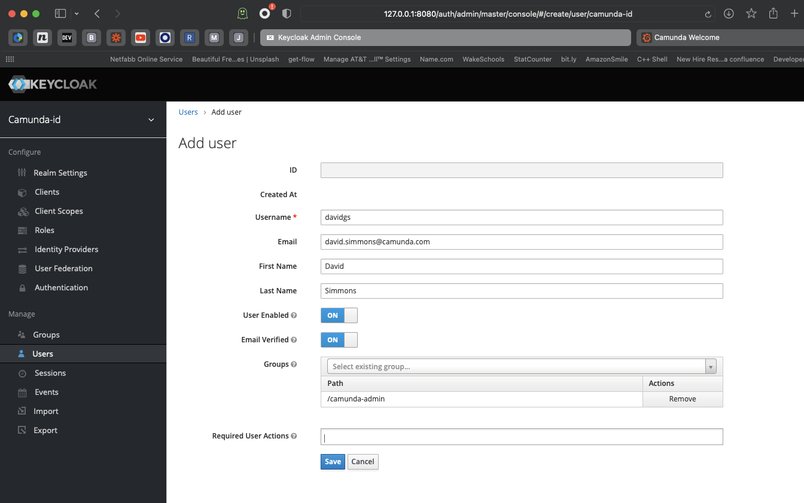

And let's set their password for good measure. I turned off the `Temporary` flag here so the user won't be forced to re-set their password.

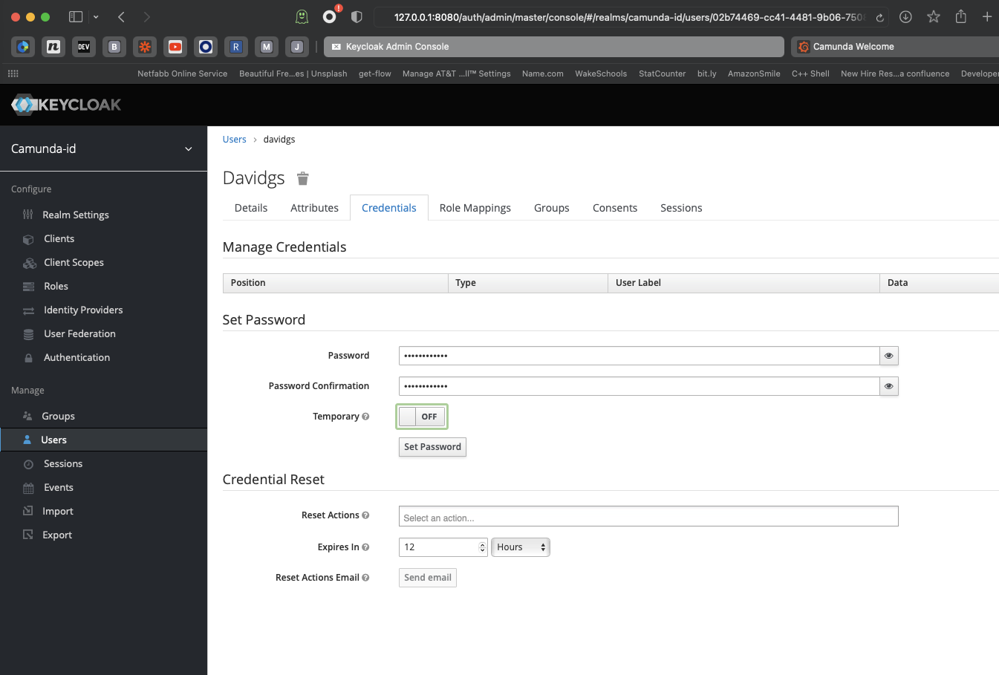

If I go back to my Camunda instance, I can now login as the newly created user!

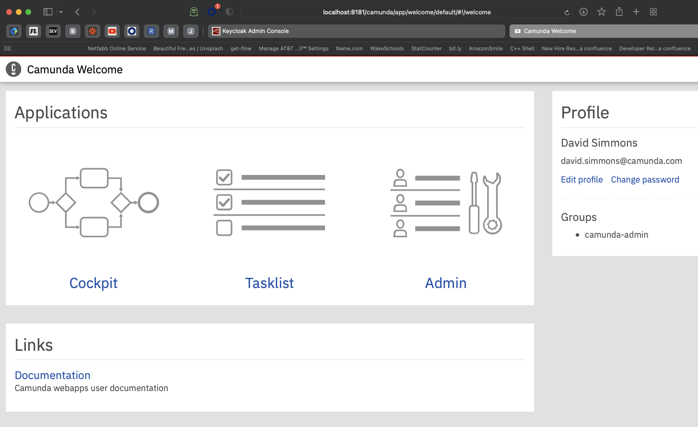

### Bonus Configuration

The drawback with this setup, of course, is that users must already exist in Keycloak before they can login to Camunda Platform. What if we want users to be able to register themselves?

It turns out that's not as hard to manage as you might imagine! First, if we go back to our Keycloak instance and look at our client configuration we will see that there is am account page enabled! If we go to that page, we can register for a new account!


And if you go there, you'll find a page with information about accounts, etc. but up in the corner, you'll notice a `Sign in` button. Clicking that button will allow you to register a new account.

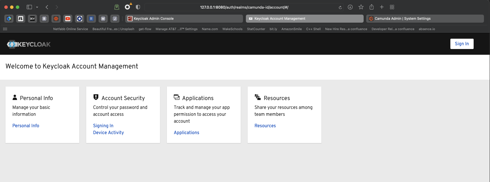

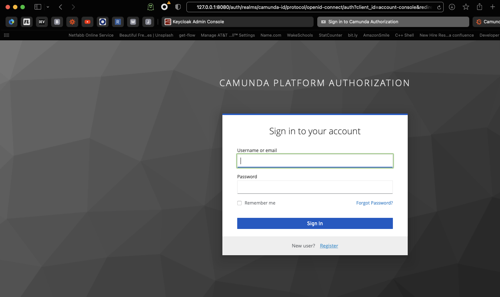

And now you have a self-service registration and authorization system for your Camunda Platform instance!


